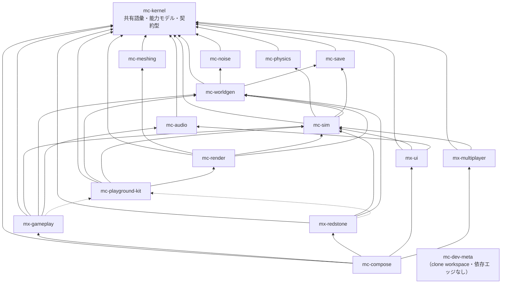

# アーキテクチャ

出典: plan.md §2。本書は plan.md の構成を mx-redstone 視点で読み直し、
`scripts/check-dependency-whitelist.ts` と `test/stage-registration.test.ts` が機械的に強制している内容と対応づけたもの。

## 1. 4 階層

単一リポジトリ（参照実装 84k LOC）では「正しく動くことが保証される単位」が大きすぎた。
そこで**ゲーム UX を構成する体験単位ごとにリポジトリを分け、各リポジトリが単独で「テスト green + プレビューで目視確認済み」を閉じる**構成を採る（plan.md §2.2）。

| 階層 | リポジトリ | 性質 |
| --- | --- | --- |
| 安定ライブラリ | `mc-kernel` / `mc-noise` / `mc-meshing` / `mc-physics` / `mc-save` / `mc-audio` | 純粋関数・狭い界面・変更頻度が低い。相互独立で並行構築可能 |
| 基盤 | `mc-worldgen` / `mc-sim` / `mc-render` / `mc-playground-kit` | 状態とサービス（**名詞**）。体験モジュールが乗る土台 |
| 体験モジュール | `mx-gameplay` / **`mx-redstone`** / `mx-ui` / `mx-multiplayer` | ルールと UI（**動詞**）。互いを知らず、基盤サービス経由でのみ会話する |
| 合成 | `mc-compose` | Layer マージ + stage 順序表 + E2E。ロジックを持たない |

これに開発用の `mc-dev-meta`（15 リポジトリを `repos/` に clone して 1 つの pnpm workspace として束ねる薄いリポジトリ、plan.md §6 Step 0）を加えて 16。

**mx-redstone は体験モジュール、すなわち動詞である。** 本書の残りはほぼ全部この一文の帰結である。

## 2. 依存グラフ（全 16 リポジトリ）

実線 = 実行時依存（`dependencies`）、点線 = プレビュー起動時のみ（`devDependencies`）。



このグラフは `scripts/check-dependency-whitelist.ts` の `REPOSITORY_POLICY.dependencyGraph`（:127-212）に全 16 行転記されており、
`test/check-dependency-whitelist.test.ts` の
`carries the complete 16-repository roster, so cycle detection can see the whole organisation`
が「16 行あること」と `checkPolicyConfiguration()` が空であること（= 自己依存なし・kernel 行なし・行先欠落なし・循環なし）を検査している。

kit のエッジ（`gameplay -.-> kit` / `redstone -.-> kit`）は**この Map には書かれていない**。
kit は devDependency 専用で実行時エッジではなく、実行時グラフに載せると `kit -> sim` と `redstone -> sim` により循環に見えてしまうためである
（`check-dependency-whitelist.ts:157-165` のコメント）。

## 3. 中心規則 — 基盤 = 名詞、体験 = 動詞（plan.md §2.3-1）

> InventoryService のような状態の置き場は基盤に、「掘ったらドロップする」というルールは体験に置く。

この規則が守れているかどうかは、**そのリポジトリが所有しているものを名詞で言えてしまうか**で判定できる。
mx-redstone について具体的に並べると次のようになる。

| | 例 | 所有者 |
| --- | --- | --- |
| **名詞（mx-redstone は所有しない）** | ピストンが押すブロック、その `pistonImmovable` 能力 | `mc-kernel`（語彙と能力モデル） |
| | ブロックが置かれているチャンク・世界 | `mc-worldgen` |
| | ピストンが押し出したプレイヤー・Mob の位置、ディスペンサが読み書きするインベントリ | `mc-sim` |
| **動詞（mx-redstone が所有する）** | 「ワイヤは 1 マスごとに 1 減衰する」 | `domain/power-graph.ts` |
| | 「トーチは入力を 1 tick 遅れで反転する」 | 同上 |
| | 「ピストンは 12 ブロックまで押す」 | `domain/piston.ts` |

「レッドストーンワイヤ」という**ブロック**は名詞であって mc-kernel の語彙である。
mx-redstone が持っているのは「そのブロックの上を電力がどう流れるか」という**規則**だけである。

### 3-1. 微妙なケース — 電力グラフは状態の形をしているが、動詞の私物である

`domain/power-graph.ts` の `CircuitBoard` / `PowerMap` は、見た目には明らかに状態である。
名詞なら基盤に置くべきではないのか、という疑問には答えがある。

**毎 tick 導出され、永続化されないから。** `propagateTick(board, previous)` は純粋関数で、
`PowerMap` は毎 redstone tick 作り直される中間結果にすぎない。セーブファイルに入らず、
他リポジトリが読む必要もなく、ワールドを読み込み直せば回路から再構成できる。
そういうものは「状態」ではなく「計算の途中経過」であり、それを計算する動詞の私物であってよい。

**もし保存が必要になったら、それは基盤への移動である。** たとえば「ワールドを閉じた瞬間のクロックの位相を復元する」
要件が出たら、その瞬間 `PowerMap` は永続化対象になり、`mc-save` のコーデックツールキットでフォーマットを定義して
`mc-sim` が所有する状態に変わる（plan.md §3.5、§3.8）。mx-redstone に残るのは「その状態をどう進めるか」だけになる。
判定基準は「セーブに入るか」であって「変数に入っているか」ではない。

## 4. 体験モジュール間のエッジがゼロである理由

グラフの体験モジュール層を見ると、`gameplay` / `redstone` / `ui` / `multiplayer` の 4 つの間に**エッジが 1 本もない**。
これは書き忘れではなく、この構成が成立する条件そのものである。

### 4-1. 「ピストンがプレイヤーを押す」はどう実現されるのか

ピストンが伸びてプレイヤーを 1 マスずらす。プレイヤーの位置は `mc-sim` の EntityManager が持っている。
したがってこれは:

```
mx-redstone が mc-sim のエンティティ状態に書く
  → 後続の stage で、その位置を気にするルール（落下判定・窒息判定・実績記録…）が読む
```

であって、`mx-redstone → mx-gameplay` の呼び出しでは**ない**。
押されたプレイヤーが溶岩に落ちて死んだ場合、その死因を記録するのは mx-gameplay の仕事だが、
mx-redstone は mx-gameplay の存在すら知らないまま正しく動く。

同じことが逆向きにも言える。mx-gameplay が水流でレバーを壊したとき、それは mc-worldgen のブロックを消す操作であり、
次の redstone tick で mx-redstone が回路を読み直したときに反映される。

### 4-2. エッジを 1 本足すと何が起きるか

失敗モードは「依存が増える」ことではない。**検証単位が併合される**ことである。

`mx-redstone → mx-gameplay` のエッジを引いた瞬間、mx-redstone のテストは mx-gameplay をビルドしないと走らなくなる。
次に mx-gameplay → mx-ui、mx-ui → mx-multiplayer と続けば、4 つの体験モジュールは
「一緒にしか検証できない 1 つの塊」になる。それは分割前のモノリスであり、
本計画の出発点（plan.md §3.15: 参照実装は合成層に 13k LOC のルールが堆積し、E2E でしか検証できなくなった）そのものである。

plan.md §2.3-1 が「体験モジュール間の依存エッジはゼロ」と言い切っているのはこのためで、
例外を 1 つ認める設計は存在しない。エッジを引きたくなったら、**手を伸ばそうとしている状態が基盤に無いだけ**である。

### 4-3. 強制は 2 箇所にある。塞いでいる穴が違う

この規則は 2 通りの方法で破れるので、検査も 2 つある。

| 検査 | 捕まえるもの | 実装 |
| --- | --- | --- |
| `pnpm check:deps` | `import ... from '@nerima-games/mx-gameplay'` | `scripts/check-dependency-whitelist.ts` の `classifyImport`（`not-whitelisted`） |
| `pnpm test` | `after: [StageId('gameplay:fluids')]` | `test/stage-registration.test.ts` の `REGRESSION: no \`after\` edge names another experience module, even though §4.2 puts redstone between gameplay stages` |

**import ゲートは後者を見られない。** `StageId` は文字列であり（`domain/frame-contract.ts:41`）、
他モジュールの stage を名指ししても import 文は 1 行も増えない。
「文字列で書ける依存」は静的解析の対象にならないので、テストで固定するしかない。
`stages/stage-ids.ts` が「このリポジトリが書き下す `StageId` を 1 ファイルに集める」構成になっているのは、
その検査対象をレビュー可能な 1 箇所にまとめるためである（`stages/stage-ids.ts:1-9`）。

対になる検査として、`REGRESSION: every declared upstream stage belongs to a foundation repository` が
`UPSTREAM_STAGE_IDS` 側（= 他リポジトリの stage を名指しする唯一の場所）も同じ条件で検査している。

## 5. このリポジトリの位置づけ — 「自己完結だったから分離できた」

plan.md §5.3 の細分化棄却表に、mx-redstone は他と違う形で登場する。

> | mx-gameplay のさらなる分割 | 共通の stage 契約を共変更する一枚岩。**自己完結だったレッドストーンは分離済みで**、残りに狭い界面がない |

つまり mx-redstone は、**mx-gameplay から実際に切り出せた唯一の部分**である。
採掘・農業・戦闘は切り出せなかった。レッドストーンだけが切り出せたのは、それが自己完結していたから
——「電力の伝播」という規則が、他のゲームルールの中身を知らずに閉じるからである。

**そしてこれは過去についての事実ではなく、維持すべき性質である。**
`test/check-dependency-whitelist.test.ts` の冒頭コメント（:1-8）がそう書いているのは、
「かつて自己完結していた」ことが「これからも自己完結している」ことを何も保証しないからである。
ディスペンサがアイテムを撃ち出す、ホッパーが中身を移す、オブザーバがブロック変更を検知する——
いずれも「ちょっとだけ mx-gameplay を見たい」誘惑がある。その誘惑に負けた瞬間、
このリポジトリが存在する根拠が消える。

## 6. 推移閉包は認めない

依存は**その依存先を import してよいという許可であって、その先を import してよいという許可ではない**
（`scripts/check-dependency-whitelist.ts` rule 3）。

mx-redstone の親は `mc-sim` と `mc-worldgen` の 2 つだけなので、次のものはすべて手の届かない場所にある。

| 届かないもの | 経路 | ゲートの判定 |
| --- | --- | --- |
| `mc-physics` | `mx-redstone -> mc-sim -> mc-physics` | `transitive-import` |
| `mc-save` | `mx-redstone -> mc-sim -> mc-save` | `transitive-import` |
| `mc-noise` | `mx-redstone -> mc-worldgen -> mc-noise` | `transitive-import` |
| `mc-meshing` / `mc-render` | 到達経路なし | `not-whitelisted` |
| `mx-gameplay` / `mx-ui` / `mx-multiplayer` | 到達経路なし（§4） | `not-whitelisted` |

メッセージの形はこうなる（`classifyImport` の `transitive-import` 分岐、`check-dependency-whitelist.ts:756-763`）。

```
stages/registration.ts:12 [transitive-import] imports @nerima-games/mc-physics, which
@nerima-games/mx-redstone only reaches transitively (@nerima-games/mx-redstone ->
@nerima-games/mc-sim -> @nerima-games/mc-physics). A transitive dependency is not an
import licence. Either declare it as a direct dependency (REPOSITORY_POLICY.dependencyGraph
+ package.json), or do not import it.
```

**経路を出すことに意味がある。** 「mc-physics は使えません」だけだと、
書いた人はたいてい「でも mc-sim が使っているのに」と思う。経路を見せると
「mc-sim が使っているのはまさに理由にならない」ことが同じ行で伝わる。

直接依存でない場合は `not-whitelisted` になり、許可リストが列挙される
（`describeAllowed()`、`check-dependency-whitelist.ts:790-794`）。

```
stages/registration.ts:1 [not-whitelisted] imports @nerima-games/mx-gameplay, which is not
a direct dependency of @nerima-games/mx-redstone. Allowed: @nerima-games/mc-sim,
@nerima-games/mc-worldgen (plus @nerima-games/mc-kernel, which every repository may import).
```

違反ゼロのときの出力は次の形で、これが現在の実測値である。

```console
$ pnpm check:deps
check-dependency-whitelist: OK — 13 file(s) scanned, allowed direct dependencies:
@nerima-games/mc-sim, @nerima-games/mc-worldgen (plus @nerima-games/mc-kernel, which every
repository may import).
```

`test/check-dependency-whitelist.test.ts` の `no transitive closure` ブロックが、
mc-physics / mc-save / mc-noise の 3 経路をメッセージ本文ごと固定している。

### 6-1. 他リポジトリの席から roster を読む

このゲートの各コピーは**全 16 行**を持っているが、import 検査が実際に参照するのは
`thisPackage` の行だけである。したがって**他所の行の誤りは、この席からは見えない**。

そのため検査関数群は `PolicyView`（`check-dependency-whitelist.ts:553`）を受け取れるようになっており、
「もしこのゲートが別のリポジトリに置かれていたら何と言うか」をテストできる
（`test/check-dependency-whitelist.test.ts:49-53` の `seatOf`）。
mc-kernel の同ファイルも同じ仕組みを持っている。

| テスト名 | 主張 |
| --- | --- |
| `REGRESSION: seated in mx-gameplay, importing mx-redstone is rejected — the zero-edge rule is symmetric` | ゼロエッジ規則は片側だけの制約ではない。mx-gameplay から見ても mx-redstone は import できない |
| `mc-compose IS allowed to import mx-redstone — it is the one repository that may` | 本リポジトリを import してよい唯一の席が compose であることを固定 |
| `REGRESSION: mc-playground-kit reaches mc-render, and mx-redstone does not` | **kit 自身の依存は普通の実行時エッジ**であり、制限されるのは kit の*消費者*だけ（§2 の注記）。ここを逆に実装するとプレビューハーネスがビルドできなくなる |

3 番目は kit ルールの誤解しやすい点をそのまま試験にしている。
「kit は devDependency 専用」は **kit を使う側**の制約であって、
kit が mc-render に依存すること自体は何の問題もない。

## 7. 不在のエッジ — mc-audio は親ではない

依存グラフを読むときに見落としやすいが、**`mx-gameplay` には `mc-audio` エッジがあり、`mx-redstone` には無い**
（plan.md §3.11 対 §3.12）。

レバーを倒せばカチッと鳴り、ピストンは伸縮音を出す。実際に音は要る。
それでも plan.md §3.12 の依存欄は `sim / worldgen（+ kit は devDependency）`であって、audio を含まない。
したがって:

- `import { SoundCuePort } from '@nerima-games/mc-audio'` は `not-whitelisted` で CI が落ちる。
- 音は `mc-sim` 経由で要求する。

**この不在は「あとで足せばいい欠落」ではなく、まず plan.md を変えるべき設計判断である。**
エッジを 1 本足すことは、mx-redstone の検証単位に mc-audio を巻き込むことであり、
plan.md §2.1 のグラフを変えることである。import 文の 1 行として静かに追加してよい類のものではない。

`test/check-dependency-whitelist.test.ts` の
`REGRESSION: mc-audio is NOT a parent, so a click sound is requested through mc-sim`
が、この不在を「うっかり足されない不在」に変えている。

## 8. リポジトリ / パッケージ / プレビューを混同しない（plan.md §2.4）

| 単位 | 役割 | 粒度 |
| --- | --- | --- |
| リポジトリ | 検証・リリースの単位（CI / バージョン / 公開） | 16 個で固定 |
| パッケージ | 依存境界の単位（リポジトリ内 workspace で維持） | 自由に細かく |
| プレビュー | 起動の単位 | 1 リポジトリに複数可 |

mx-redstone は現在パッケージ分割しておらず、`domain/` + `stages/` の 2 ディレクトリである。
回路盤サンドボックスを `apps/preview-circuit-board/` に足しても（plan.md §4.1）リポジトリは増えない。
